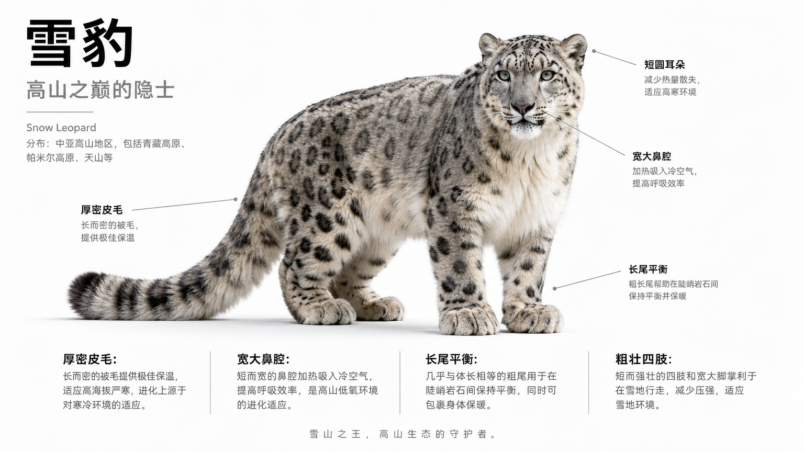
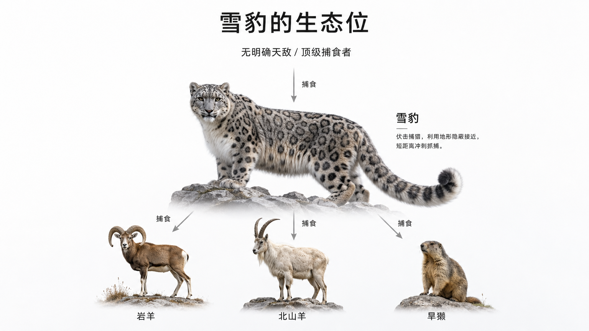

# Bio Explainer

Bio Explainer is a local BYOK web app for generating illustrated biology explainers.

Enter a species name, choose a perspective, and the app generates an image-based explanation for morphology, evolution, or ecology. You can click on any region of a generated image to drill down into a more detailed follow-up page. Generated images and metadata are cached locally so repeated exploration can reuse existing assets.

## Features

- Local FastAPI app with a static browser UI
- Bring your own API keys
- OpenAI-compatible chat model configuration for text planning
- GPT Image generation for all visual pages
- Optional image API Base URL field for compatible deployments
- Local cache for generated images, captions, species profiles, and drill-down pages
- Prompt editor in the settings panel
- Demo image assets included in `static/generated`

## Quick Start

Install dependencies and run the app:

```powershell
uv sync
uv run uvicorn server.main:app --reload --host 127.0.0.1 --port 8000
```

Open:

```text
http://127.0.0.1:8000
```

In the settings panel, configure:

- LLM API key, Base URL, and model for text planning
- Image API key and image model for GPT Image generation
- Optional image Base URL if you use a compatible image API deployment
- Image resolution and quality

If the image Base URL is left blank, the OpenAI SDK default endpoint is used.

## Demo Assets

This repository includes several generated demo assets under:

- `static/generated`
- `static/species`

These files make the project easier to inspect without generating every example from scratch. They are example outputs, not authoritative scientific references.

Example cached pages include snow leopard, king crab, and Gorgonops-style biology explainer screens.

### Demo Gallery

Snow leopard morphology:



Snow leopard ecology:



King crab morphology:


## Cache Behavior

Generated pages are saved as paired files:

```text
static/generated/{page_id}.png
static/generated/{page_id}.json
```

Species profiles are saved in:

```text
static/species/{profile_id}.json
```

The app can restore cached pages by species name and language. Drill-down clicks also reuse nearby cached child pages to avoid unnecessary image regeneration.

## Limitations

- GPT Image generation can be slow, especially at higher resolution or quality settings.
- The current factual workflow depends on the text model and GPT Image model's general knowledge. Rare species, niche organisms, and especially paleobiology topics may produce factual errors, visual mismatches, or species confusion.
- Modern, common, well-documented species are recommended for best results.
- For public science communication or educational publishing, manually verify taxonomy, ecology, diet, timelines, and visual anatomy before use.

## Security

- API keys are stored only in the local `server/config.local.json` file.
- `server/config.local.json`, `.env`, virtual environments, logs, and Python caches are ignored by git.
- API keys are not returned in API responses.

## Development

Run tests:

```powershell
uv run pytest
```

Useful project paths:

```text
server/          FastAPI app, model clients, cache, prompt assembly
static/          Browser UI and demo assets
tests/           Unit and API tests
```

## References

The product direction and prompt work were informed by:

- [vthinkxie/illustrated-explainer-spec](https://github.com/vthinkxie/illustrated-explainer-spec)
- Science illustration prompt ideas shared by @berryxia on X
